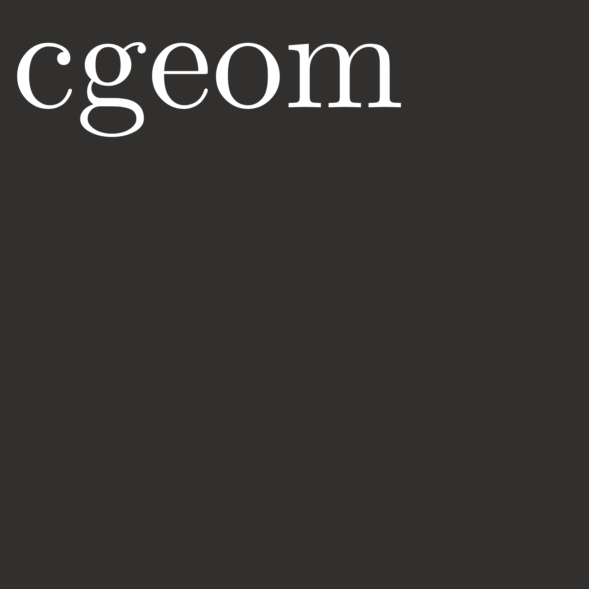

<h1 align="left">

</h1>

[](https://pypi.org/project/compute-geometry/)
[](https://github.com/kleyt0n/compute-geometry/blob/master/LICENSE)


**compute-geometry** is a research-focused computational geometry library for Python. This library is designed to provide a set of tools and algorithms for solving geometric problems.

## Installation

You can install the **compute-geometry** library using `pip`:

```bash
uv add compute-geometry
```

## Getting Started

```python
import cgeom
```

Here are some examples to demonstrate how to use the Geometry library:

```python
# Example 1: Compute the convex hull of a set of points

from cgeom.algorithms import ConvexHull

# create a list of points
points = [(326, 237),(373, 209), (378, 265), (443, 241), (396, 231), (416, 270), (361, 335), (324, 297)]

# create a convex hull object with the list of points
convex_hull = ConvexHull(points)

# plot the convex hull
convex_hull.plot()

# print the indexes of the points that form the convex hull
print('Convex Hull: ', convex_hull.get_indexes())


# Example 2: Compute Voronoi diagram of a set of points

from cgeom.algorithms import VoronoiDiagram

# load a set of points
points = np.loadtxt("./points1.txt")

# create a voronoi diagram object
voronoi = VoronoiDiagram(points)

# build the voronoi diagram
cells = voronoi.build_voronoi_diagram()

# plot the voronoi diagram
voronoi.plot_voronoi(cells)

```

## License

This library is licensed under the [MIT License](LICENSE), allowing you to use, modify, and distribute it for both commercial and non-commercial purposes.

Start exploring the world of computational geometry with the _compute-geometry_ library in Python!