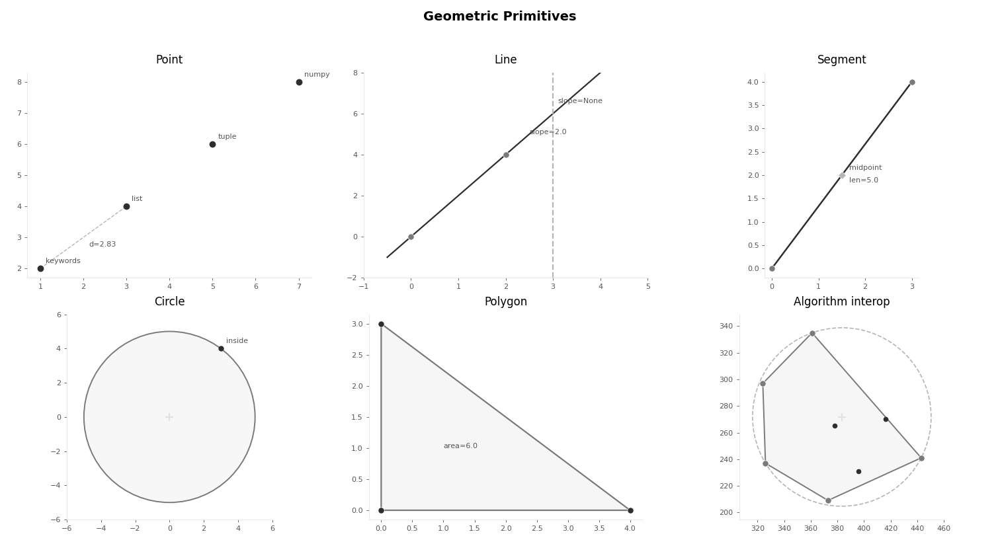

<h1 align="left">

</h1>

[](https://pypi.org/project/compute-geometry/)
[](https://github.com/kleyt0n/compute-geometry/blob/master/LICENSE)


**compute-geometry** is a research-focused computational geometry library for Python. This library is designed to provide a set of tools and algorithms for solving geometric problems.

[ROADMAP](ROADMAP.md)

## Installation

You can install the **compute-geometry** library using `uv`:

```bash
uv add compute-geometry
```

## Getting Started

```python
import cgeom
```

Here are some examples to demonstrate how to use the Geometry library:

```python
import numpy as np
from cgeom.algorithms import VoronoiDiagram
from cgeom.visualization import plot_voronoi

# load a set of points
points = np.loadtxt("examples/points1.txt")

# create a voronoi diagram object
voronoi = VoronoiDiagram(points)

# build the voronoi diagram
cells = voronoi.build_voronoi_diagram()

# plot the voronoi diagram
plot_voronoi(voronoi, cells)

```

## Elements



## License

This library is licensed under the [MIT License](LICENSE), allowing you to use, modify, and distribute it for both commercial and non-commercial purposes.

Start exploring the world of computational geometry with the _compute-geometry_ library in Python!
